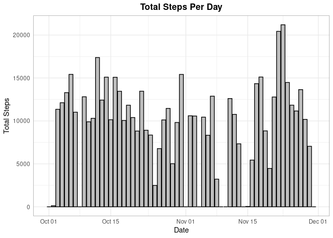
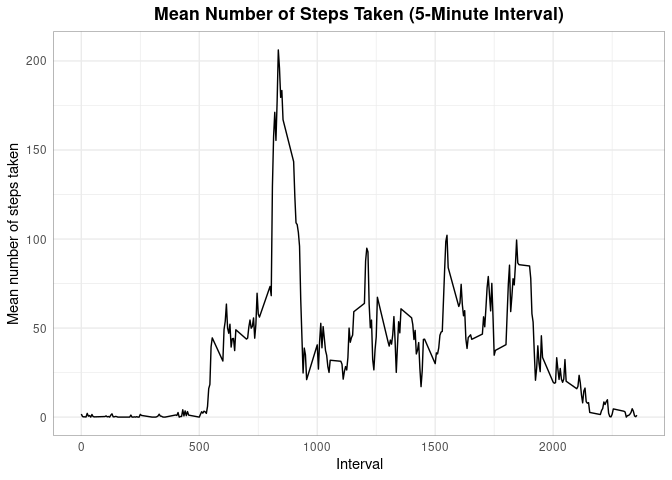
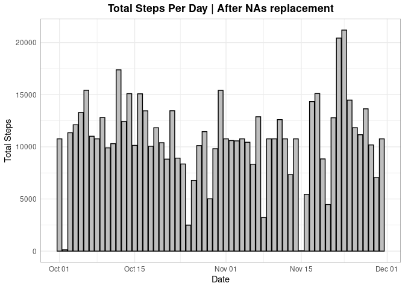
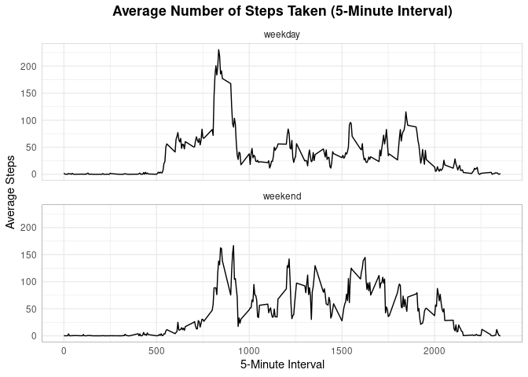

## Loading and preprocessing the data

```r
# Loading the libraries
library(data.table)
library(dplyr)
```

```
## 
## Attaching package: 'dplyr'
```

```
## The following objects are masked from 'package:data.table':
## 
##     between, first, last
```

```
## The following objects are masked from 'package:stats':
## 
##     filter, lag
```

```
## The following objects are masked from 'package:base':
## 
##     intersect, setdiff, setequal, union
```

```r
library(ggplot2)

#Loading the data
data <- fread("activity.csv")

# Converting the Date column to date format
data$date <- as.Date(data$date)
```

## What is mean total number of steps taken per day?

```r
# Calculating total steps per day
total_steps_PD <- data %>%
        group_by(date)  %>%
        summarise(TotalStepsPerDay = sum(steps, na.rm = TRUE), .groups = "drop")

# Creating a histogram
ggplot(total_steps_PD, aes(x = date, y = TotalStepsPerDay)) +
        geom_bar(stat = "identity", fill = "gray", color = "black") +  # Setting fill and border color
        labs(title = "Total Steps Per Day",x = "Date",y = "Total Steps") +
        scale_x_date(date_labels = "%b %d") +
        theme_minimal() +
        theme(panel.border = element_rect(color = "black", fill = NA, size = 0.1), # Setting the border of a plot
              plot.title = element_text(hjust = 0.5, face = "bold") #Centering the title and making it bold
        )
```

<!-- -->

```r
# Calculating the mean and median of total steps per day
total_steps_Mean <- mean(total_steps_PD$TotalStepsPerDay) 
print(total_steps_Mean)
```

```
## [1] 9354.23
```

```r
total_steps_Median <- median(total_steps_PD$TotalStepsPerDay)
```
**Mean of total number of steps taken per day is 9354.23**

## What is the average daily activity pattern?

```r
# Grouping the data by interval and calculating the average steps
interval_avg_steps <- data %>%
        group_by(interval) %>%
        summarise(steps = mean(steps, na.rm = TRUE), .groups = "drop") %>%
        rename(interval = interval, steps = steps)

# Creating a line plot
ggplot(interval_avg_steps, aes(x = interval, y = steps)) +
        geom_line() +
        labs(title = "Mean Number of Steps Taken (5-Minute Interval)",
             x = "Interval",
             y = "Mean number of steps taken") +
        theme_minimal() +
        theme(panel.border = element_rect(color = "black", fill = NA, size = 0.1),
              plot.title = element_text(hjust = 0.5, face = "bold"))
```

<!-- -->

```r
# Calculating average steps for each 5 minute interval across all dates
average_steps_interval <- data %>%
        filter(interval == 5) %>%
        group_by(date) %>%
        summarise(IntervalStepsAvg = mean(steps, na.rm = TRUE), .groups = "drop")

# Finding the interval with the maximum average steps
max_interval <- max(average_steps_interval$IntervalStepsAvg, na.rm = TRUE) 
```

## Imputing missing values

```r
# Calculating the mean steps for 5-minute intervals
interval_mean <- data %>%
        group_by(interval) %>%
        summarise(IntervalMean = mean(steps, na.rm = TRUE), .groups = "drop")

# Filling missing values with interval mean using left join
replaced_NAs <- data %>%
        left_join(interval_mean, by = "interval") %>%
        mutate(steps = ifelse(is.na(steps), IntervalMean, steps), IntervalMean = NULL)

# Calculating total steps per day after imputing missing values
total_steps_PD_after <- replaced_NAs %>%
        group_by(date) %>%
        summarise(TotalStepsPerDay = sum(steps), .group="drop")
```

```
## `summarise()` ungrouping output (override with `.groups` argument)
```

```r
# Creating a histogram
ggplot(total_steps_PD_after, aes(x = date, y = TotalStepsPerDay)) +
        geom_bar(stat = "identity", fill = "gray", color = "black") +  # Setting fill and border color
        labs(title = "Total Steps Per Day | After NAs replacement",x = "Date",y = "Total Steps") +
        scale_x_date(date_labels = "%b %d") +
        theme_minimal() +
        theme(panel.border = element_rect(color = "black", fill = NA, size = 0.1), # Setting the border of a plot
              plot.title = element_text(hjust = 0.5, face = "bold") #Centering the title and making it bold
        )
```

<!-- -->

```r
# Calculating the mean and median of total steps per day
total_steps_Mean_After <- mean(total_steps_PD_after$TotalStepsPerDay)
total_steps_Median_After <- median(total_steps_PD_after$TotalStepsPerDay)
```

## Are there differences in activity patterns between weekdays and weekends?

```r
# Creating a factor variable 'day_type' indicating weekday or weekend
replaced_NAs$day_type <- factor(weekdays(replaced_NAs$date) %in% c("Saturday", "Sunday"), 
                                levels = c(FALSE, TRUE), labels = c("weekday", "weekend"))

# Calculate average steps per interval for weekdays and weekends separately
interval_steps_avg_DayType <- replaced_NAs %>%
        group_by(interval, day_type) %>%
        summarise(DayTypeAvgSteps = mean(steps, na.rm = TRUE), .groups = "drop")

# Creating a panel plot
ggplot(interval_steps_avg_DayType, aes(x = interval, y = DayTypeAvgSteps)) +
        geom_line() +
        labs(title = "Average Number of Steps Taken (5-Minute Interval)",
             x = "5-Minute Interval",
             y = "Average Steps") +
        facet_wrap(~ day_type, ncol = 1) +  # Create separate panels for each day_type
        theme_minimal() +
        theme(panel.border = element_rect(color = "black", fill = NA, size = 0.1),
              plot.title = element_text(hjust = 0.5, face = "bold"))
```

<!-- -->
